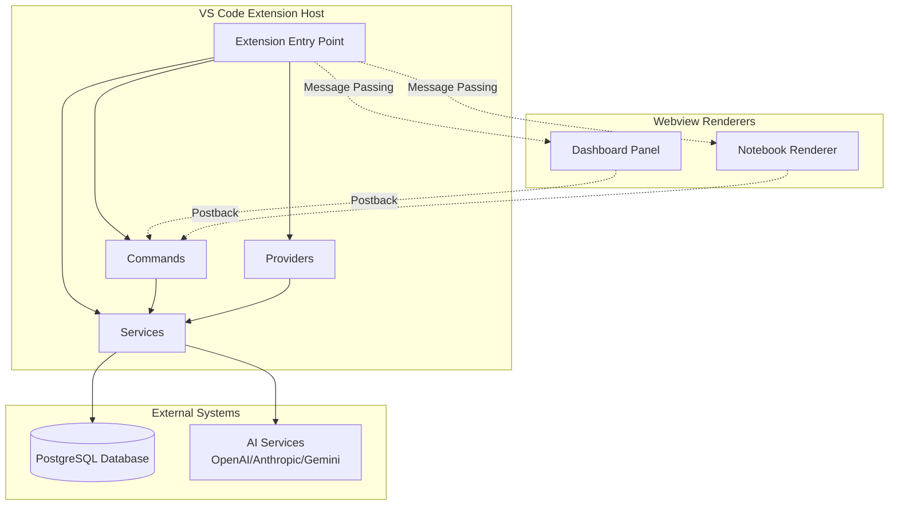
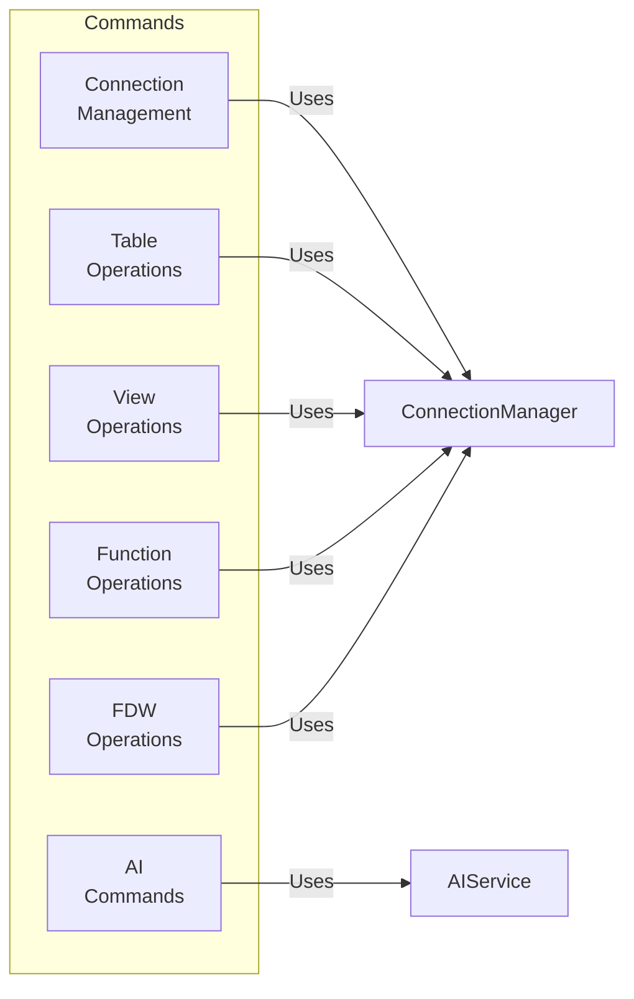
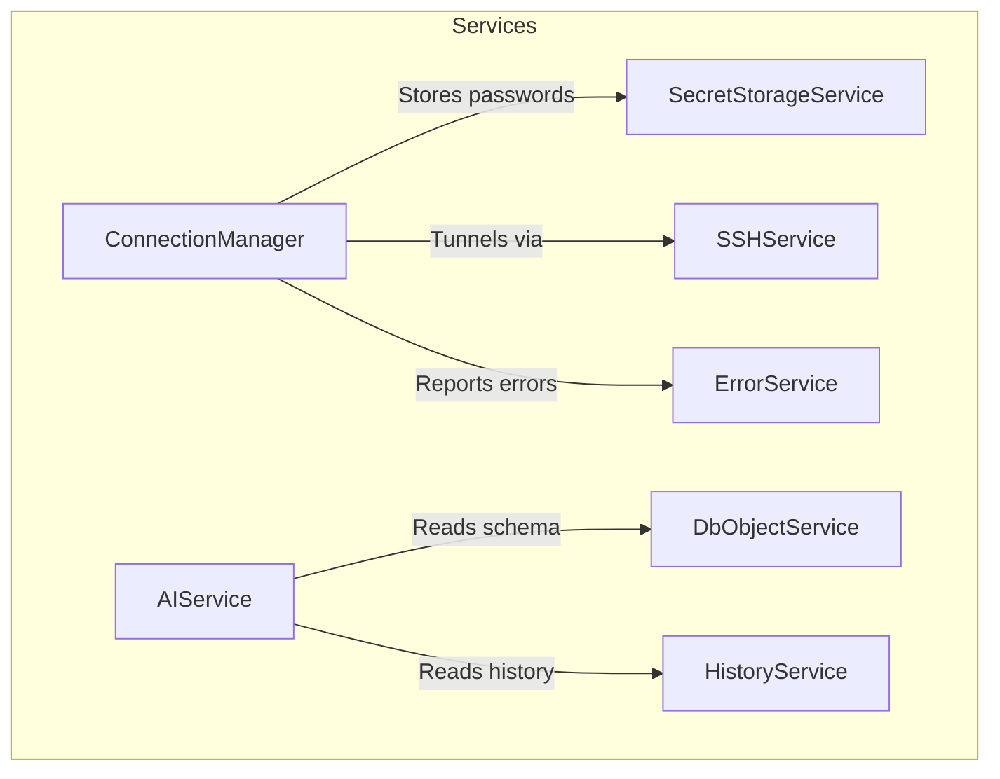
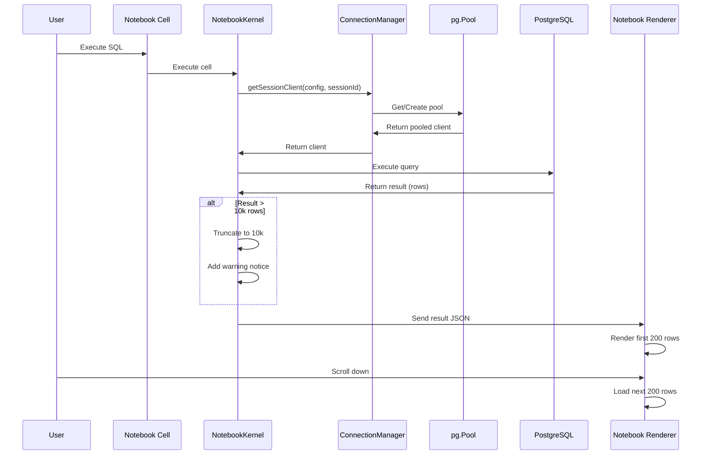
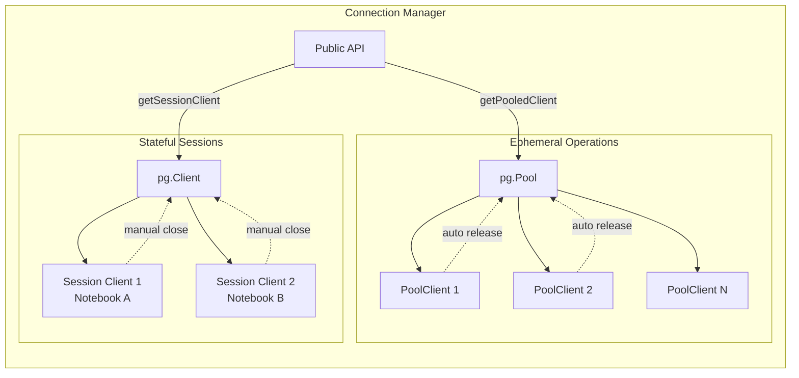
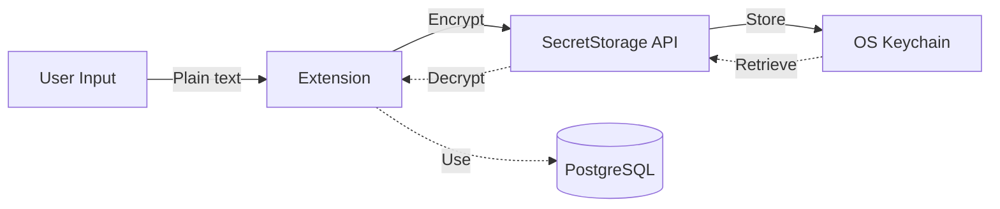

# PgStudio Architecture

> **Last Updated**: December 2025

This document provides a comprehensive overview of PgStudio's architecture, design decisions, and component interactions.

---

## Table of Contents

- [System Overview](#system-overview)
- [Component Architecture](#component-architecture)
- [Data Flow](#data-flow)
- [Key Design Decisions](#key-design-decisions)
- [Extension Points](#extension-points)

---

## System Overview

PgStudio is a VS Code extension that provides comprehensive PostgreSQL database management capabilities. The architecture follows a modular design with clear separation between the Extension Host (Node.js) and Webview Renderers (Browser).



---

## Component Architecture

### Extension Host Components

#### 1. **Extension Entry Point** (`src/extension.ts`)
- Registers commands, providers, and services
- Initializes connection manager and secret storage
- Sets up message passing for webviews
- Manages extension lifecycle

#### 2. **Commands** (`src/commands/`)
Implements VS Code commands for database operations:



**Key Command Files**:
- `connections.ts` - Add, edit, delete, test connections
- `tables.ts` - CRUD, VACUUM, ANALYZE, REINDEX, scripts
- `views.ts` - View operations and scripts
- `functions.ts` - Function management
- `fdw.ts` - Foreign Data Wrapper operations
- `ai.ts` - AI-powered query generation and optimization

#### 3. **Providers** (`src/providers/`)
Implements VS Code provider interfaces:

- **`DatabaseTreeProvider.ts`** - Tree view for database objects
- **`SqlCompletionProvider.ts`** - SQL autocomplete
- **`NotebookKernel.ts`** - SQL notebook execution kernel
- **`DashboardPanel.ts`** - Real-time monitoring dashboard

#### 4. **Services** (`src/services/`)
Core business logic and infrastructure:



**Service Responsibilities**:

| Service | Purpose |
|---------|---------|
| `ConnectionManager` | Hybrid pooling (`pg.Pool` + `pg.Client`), connection lifecycle |
| `SecretStorageService` | Encrypted password storage via VS Code API |
| `SSHService` | SSH tunnel management for remote connections |
| `AIService` | AI provider abstraction (OpenAI, Anthropic, Gemini) |
| `HistoryService` | Query history tracking for AI context |
| `ErrorService` | Centralized error handling and reporting |
| `DbObjectService` | Database schema introspection and caching |

---

### Webview Components

#### 1. **Dashboard Panel** (`src/panels/DashboardPanel.ts`)
Real-time monitoring interface showing:
- Active connections (`pg_stat_activity`)
- Database size and growth
- Table statistics
- Index health
- Long-running queries

**Technology**: HTML + CSS + Vanilla JavaScript with Chart.js

#### 2. **Notebook Renderer** (`src/renderer_v2.ts`)
Renders SQL query results in notebooks with:
- **Infinite Scrolling** (200 rows/chunk via `IntersectionObserver`)
- Interactive table with column resizing
- Inline cell editing (double-click)
- Chart visualization (Chart.js)
- Export to CSV/JSON/Excel
- AI-powered data analysis

**Modular Structure**:
```
src/renderer/
├── components/
│   └── ui.ts           # Reusable UI components (buttons, tabs)
└── features/
    ├── export.ts       # Export functionality
    └── ai.ts           # AI analysis features
```

---

## Data Flow

### Query Execution Flow



### Connection Pooling Strategy

PgStudio uses a **hybrid pooling approach**:



**Why Hybrid?**
- **`pg.Pool`** for commands (tree refresh, CRUD operations) - automatic connection reuse
- **`pg.Client`** for notebooks - maintains transaction state across cells

---

## Key Design Decisions

### 1. **Infinite Scrolling over Virtual Scrolling**

**Problem**: Rendering 10k+ rows freezes the UI.

**Solution**: 
- Backend truncates results to 10k rows (prevents crashes)
- Frontend renders in 200-row chunks
- `IntersectionObserver` triggers loading on scroll

**Trade-offs**:
- ✅ Simple implementation
- ✅ Works with existing table structure
- ✅ No complex windowing logic
- ⚠️ All 10k rows in memory (acceptable for max limit)

### 2. **Hybrid Connection Pooling**

**Problem**: 
- Commands need short-lived connections
- Notebooks need persistent connections (transactions)

**Solution**:
```typescript
// Ephemeral (auto-released)
const client = await ConnectionManager.getInstance().getPooledClient(config);
try {
  await client.query('SELECT ...');
} finally {
  client.release(); // Returns to pool
}

// Stateful (manual lifecycle)
const client = await ConnectionManager.getInstance()
  .getSessionClient(config, notebookUri);
// Client persists across cells
// Closed when notebook closes
```

### 3. **AI Context Optimization**

**Problem**: Sending full schema on every AI request is expensive.

**Solution**:
- **Schema Caching**: `DbObjectService` caches table/column metadata
- **Selective Context**: Only send relevant tables based on query
- **History Integration**: Include recent queries for better suggestions

### 4. **Modular Renderer Architecture**

**Problem**: `renderer_v2.ts` was 144KB monolith.

**Solution**:
```
renderer_v2.ts (main)
├── renderer/components/ui.ts      # Buttons, tabs, modals
└── renderer/features/
    ├── export.ts                  # CSV/JSON/Excel export
    └── ai.ts                      # AI analysis integration
```

**Benefits**:
- Easier testing
- Clear separation of concerns
- Reusable components

---

## Extension Points

### Adding a New Command

1. **Define command** in `package.json`:
```json
{
  "command": "postgres-explorer.myCommand",
  "title": "My Command",
  "category": "PostgreSQL"
}
```

2. **Implement handler** in `src/commands/myCommand.ts`:
```typescript
export async function myCommandHandler(node: TreeNode) {
  const client = await ConnectionManager.getInstance()
    .getPooledClient(node.connection);
  try {
    await client.query('...');
  } finally {
    client.release();
  }
}
```

3. **Register** in `src/extension.ts`:
```typescript
context.subscriptions.push(
  vscode.commands.registerCommand(
    'postgres-explorer.myCommand',
    myCommandHandler
  )
);
```

### Adding a New AI Provider

Implement the `AIProvider` interface in `src/services/AIService.ts`:

```typescript
interface AIProvider {
  generateQuery(prompt: string, context: SchemaContext): Promise<string>;
  optimizeQuery(query: string, context: SchemaContext): Promise<string>;
  explainError(error: string, query: string): Promise<string>;
}
```

### Extending the Tree View

Add new node types in `DatabaseTreeProvider.ts`:

```typescript
class MyCustomNode extends TreeNode {
  contextValue = 'myCustomNode';
  
  async getChildren(): Promise<TreeNode[]> {
    // Return child nodes
  }
}
```

---

## Performance Considerations

### Connection Pool Sizing

Default pool configuration:
```typescript
{
  max: 10,              // Max connections per pool
  idleTimeoutMillis: 30000,
  connectionTimeoutMillis: 2000
}
```

### Result Set Limits

- **Backend**: 10,000 rows (hard limit in `NotebookKernel.ts`)
- **Frontend**: 200 rows/chunk (configurable in `renderer_v2.ts`)

### Memory Management

- Pools automatically release idle connections
- Session clients closed on notebook disposal
- Result truncation prevents OOM errors

---

## Security

### Password Storage



- Passwords stored via VS Code `SecretStorage` API
- Encrypted by OS keychain (Keychain on macOS, Credential Manager on Windows, libsecret on Linux)
- Never stored in plain text

### SSH Tunnels

- Supports SSH key-based authentication
- Tunnels created per connection
- Automatically cleaned up on disconnect

---

## Testing Strategy

### Unit Tests
- `src/test/unit/` - Service layer tests
- Mock `pg.Pool` and `pg.Client`
- Test connection lifecycle

### Integration Tests
- Require local PostgreSQL instance
- Test actual query execution
- Verify result rendering

### Manual Testing
- Use test database with large tables
- Verify infinite scrolling
- Test AI features with real providers

---

## Future Architecture Improvements

1. **WebSocket for Real-time Updates** - Replace polling in dashboard
2. **Worker Threads for Large Exports** - Offload CSV/Excel generation
3. **Query Result Streaming** - Stream rows instead of loading all at once
4. **Distributed Tracing** - Add telemetry for performance monitoring
5. **Plugin System** - Allow third-party extensions

---

## References

- [VS Code Extension API](https://code.visualstudio.com/api)
- [node-postgres Documentation](https://node-postgres.com/)
- [Chart.js Documentation](https://www.chartjs.org/)
- [PostgreSQL System Catalogs](https://www.postgresql.org/docs/current/catalogs.html)
